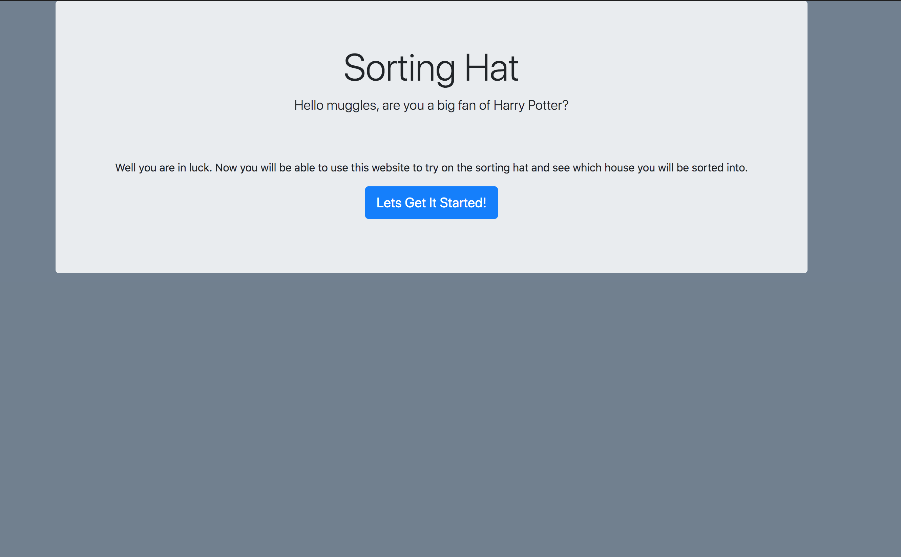
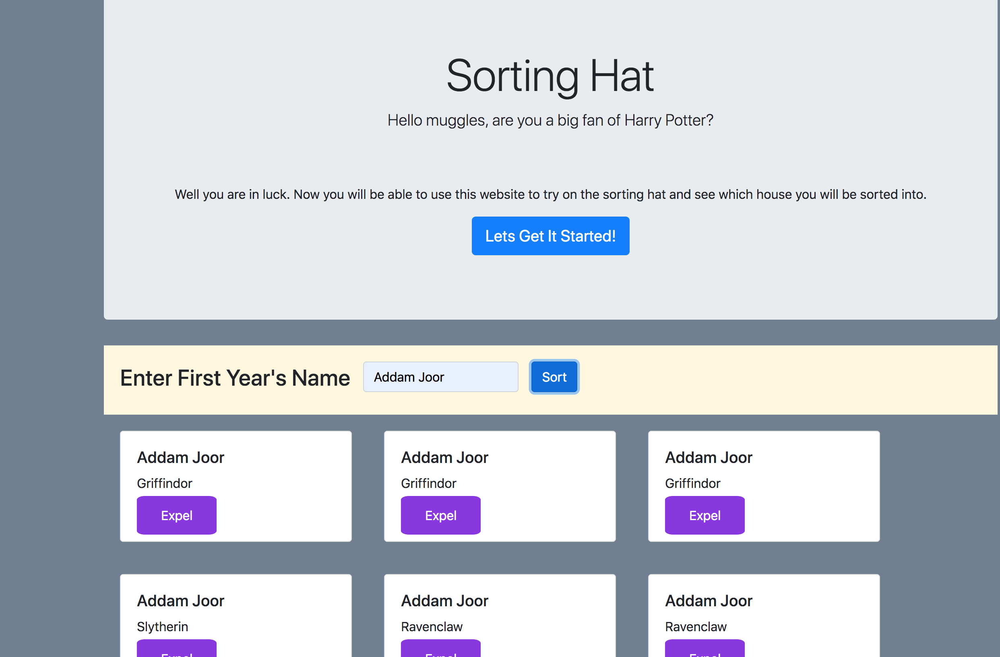
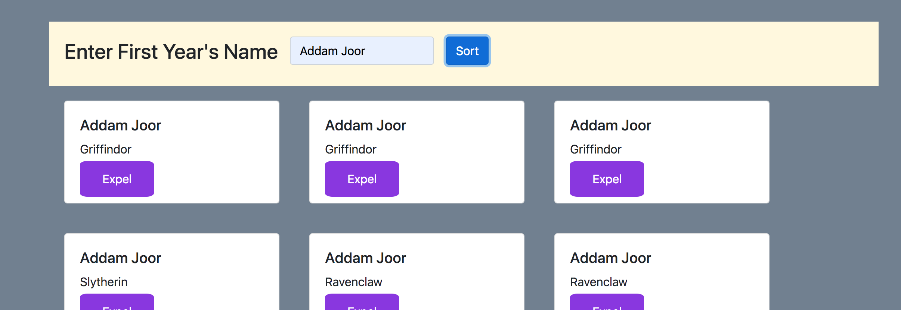
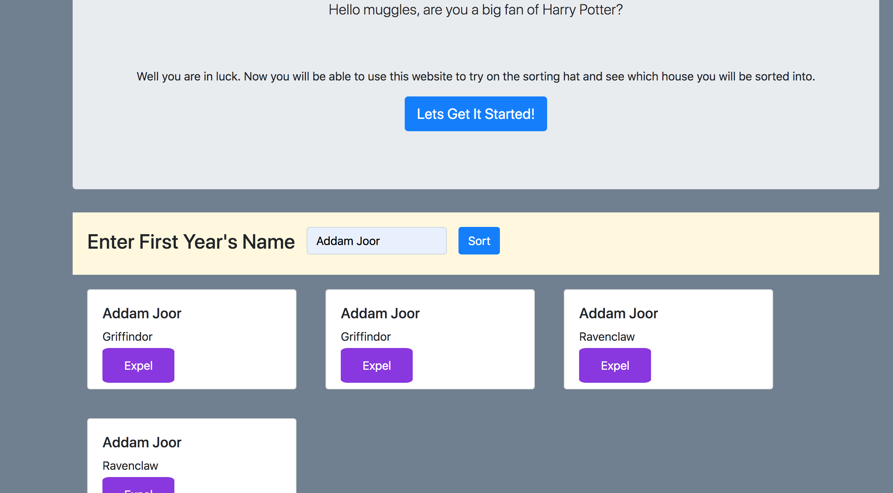

# SORTING-HAT

## Description

This project show cases the use of basic javascript. Its designed to create cards based on the users input and spit out a card with a random hogwarts house, their name, and a delete (expel) button.

## Feature List
- The site starts out with a bootstrap jumbo tron.

- Clicking the get started button will open up a form to fill out.

- Once you finished putting in your first and last name click the submit button

- A card will be created with the information that you submittd along with a random hogwarts house.

- populate as many as you want

- click the expel button to delete the cards.

## Screenshots

## How to Run

- Clone down this repo

- Make sure you have http-server installed via npm. If not get it HERE](https://www.npmjs.com/package/http-server).

- On your command line run `hs -p 9999`

- In your browser go to `http://localhost:9999`

## Contributors

[Zac Crumpton](https://github.com/ZacCrumpton)